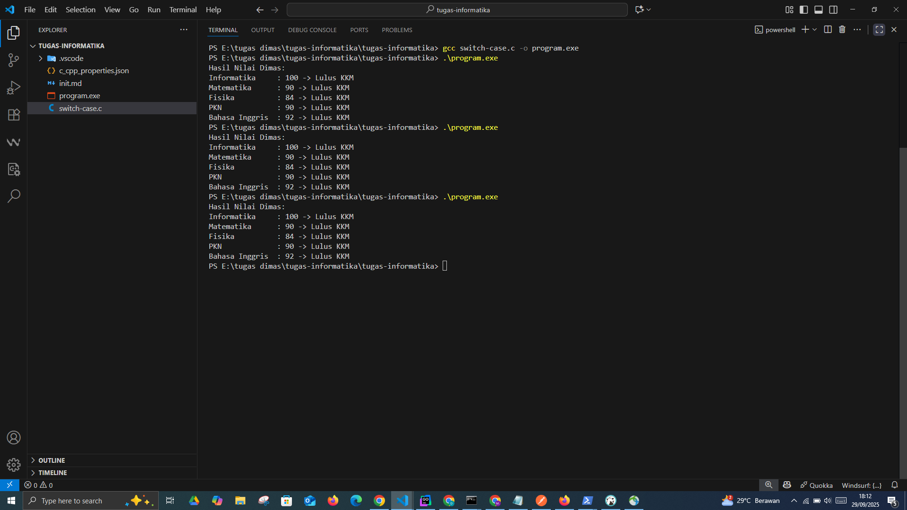
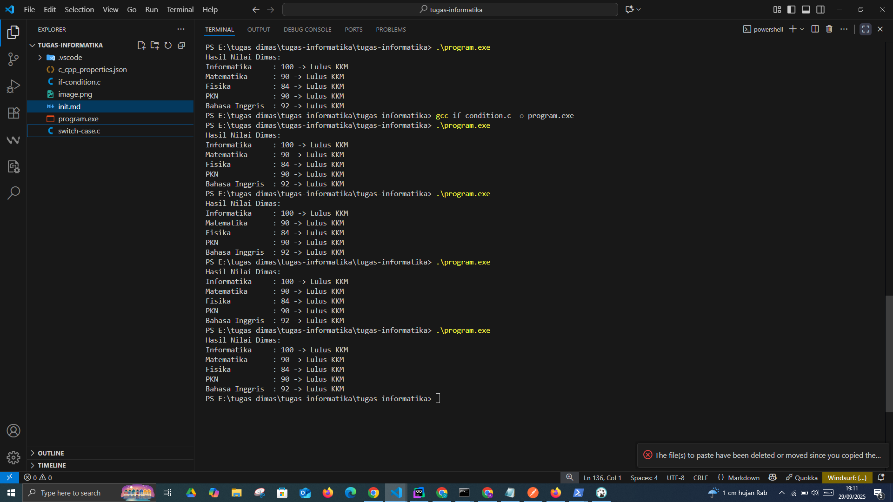
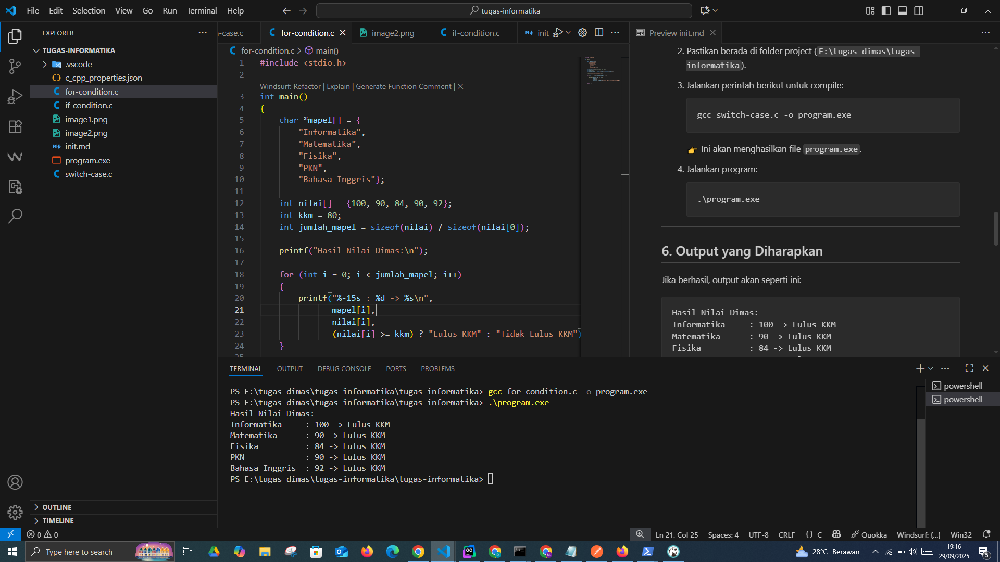

# Task Informatika C-Langunge
Task yang berisi Dasar Pemrograman Bahasa C Dalam beberapa versi pengecekan if condtion, for (perulangan), dan switch case.

#

# Panduan Install C dan Testing di VS Code

## 1. Install Compiler C
Untuk bisa menjalankan program C, kita butuh compiler (GCC).

### Cara Install
- Kunjungi [installc.org](https://installc.org/).
- Ikuti instruksi untuk menginstall **GCC (MinGW)** otomatis di Windows.
- Setelah selesai, buka **Command Prompt (CMD)** atau **PowerShell**.
- Ketik perintah berikut untuk memastikan GCC sudah terpasang:
  ```bash
  gcc --version
  ```
  Jika berhasil, akan muncul versi GCC, contoh:
  ```
  gcc (Rev10, Built by MSYS2 project) 13.2.0
  ```

---

## 2. Install VS Code
- Download Visual Studio Code dari [https://code.visualstudio.com](https://code.visualstudio.com).
- Install seperti biasa.
- Setelah itu, buka VS Code.

---

## 3. Tambahkan Extension di VS Code
Agar coding C lebih nyaman:
- Buka **Extensions** (`Ctrl + Shift + X`).
- Cari dan install:
  - **C/C++ (by Microsoft)**
  - **Code Runner** (opsional, untuk run cepat)

---

## 4. Buat File C Pertama
1. Buat folder baru, misalnya:  
   ```
   E:\tugas dimas\tugas-informatika
   ```
2. Di VS Code, buat file baru dengan nama:
   ```
   switch-case.c
   ```
3. Isi dengan kode berikut:

   ```c
   #include <stdio.h>

   int main() {
       int informatika_dimas = 100;
       int matematika_dimas = 90;
       int fisika_dimas = 84;
       int pkn_dimas = 90;
       int bahasa_inggris_dimas = 92;

       printf("Hasil Nilai Dimas:\n");

       // Informatika
       switch (informatika_dimas >= 80) {
           case 1: printf("Informatika     : %d -> Lulus KKM\n", informatika_dimas); break;
           default: printf("Informatika     : %d -> Tidak Lulus KKM\n", informatika_dimas);
       }

       // Matematika
       switch (matematika_dimas >= 80) {
           case 1: printf("Matematika      : %d -> Lulus KKM\n", matematika_dimas); break;
           default: printf("Matematika      : %d -> Tidak Lulus KKM\n", matematika_dimas);
       }

       // Fisika
       switch (fisika_dimas >= 80) {
           case 1: printf("Fisika          : %d -> Lulus KKM\n", fisika_dimas); break;
           default: printf("Fisika          : %d -> Tidak Lulus KKM\n", fisika_dimas);
       }

       // PKN
       switch (pkn_dimas >= 80) {
           case 1: printf("PKN             : %d -> Lulus KKM\n", pkn_dimas); break;
           default: printf("PKN             : %d -> Tidak Lulus KKM\n", pkn_dimas);
       }

       // Bahasa Inggris
       switch (bahasa_inggris_dimas >= 80) {
           case 1: printf("Bahasa Inggris  : %d -> Lulus KKM\n", bahasa_inggris_dimas); break;
           default: printf("Bahasa Inggris  : %d -> Tidak Lulus KKM\n", bahasa_inggris_dimas);
       }

       return 0;
   }
   ```

---

## 5. Compile dan Jalankan Program
1. Buka **Terminal** di VS Code (`Ctrl + ``).
2. Pastikan berada di folder project (`E:\tugas dimas\tugas-informatika`).
3. Jalankan perintah berikut untuk compile:
   ```bash
  gcc src/switch-case.c -o program.exe
  gcc src/if-condition.c -o program.exe
  gcc src/for-condition.c -o program.exe

   ```
   👉 Ini akan menghasilkan file `program.exe`.

4. Jalankan program:
   ```bash
   .\program.exe
   ```

---

## 6. Output yang Diharapkan
Jika berhasil, output akan seperti ini:

```
Hasil Nilai Dimas:
Informatika     : 100 -> Lulus KKM
Matematika      : 90 -> Lulus KKM
Fisika          : 84 -> Lulus KKM
PKN             : 90 -> Lulus KKM
Bahasa Inggris  : 92 -> Lulus KKM
```

## 7. Result in local
### file switch-case.c:


### file if-condition.c:


### file for-condition.c:

---

## 8. Catatan
- Jika muncul error `cannot open source file "stdio.h"`, itu hanya masalah IntelliSense di VS Code.  
  Compile tetap bisa jalan.  
- Jalankan program di PowerShell pakai `.\program.exe`, bukan `program.exe`.  

---
✅ Sekarang kamu sudah bisa ngoding C di Windows dengan VS Code!
